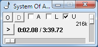

# pplay

Simple audio player written in python3.



## Description

This is a small audio player written in python3.
It uses vlc as backend player and mutagen (python3-mutagen)
package to obtain audio files metadata.

## Installation

### Dependencies

Player depends on installed [vlc player](https://www.videolan.org/).

Also it depends on python mutagen package. 

On debian linux it can be installed via apt package manager:

```
apt-get install python3-mutagen
```

For Windows it can be downloaded from [unofficial package builds](https://www.lfd.uci.edu/~gohlke/pythonlibs/).

Alternatively, it can also be installed  via pip3:

```
pip3 install mutagen
```

### Install

You may clone this repo and run (at the root folder of reposotory clone):

```
pip3 install --upgrade .
```

Alternatively you may download the python *wheel* package and install it:

```
pip3 install --upgrade pplay-1.0-py3-none-any.whl
```

Another way is to install directly from remote repository:

```
pip3 install --upgrade git+https://github.com/goriy/pplay.git
```

## Usage

### Command line

Usage: pplay [file]

### Hotkeys

* Esc - exit
* O - show open file dialog to choose audio file to play.
* L - toggle loop playback
* A - toggle window topmost (always on top) mode
* U - toggle option to unload player after playback
* Space - toggle play/pause
* Left, Right - change current playback position (ff, rewind)
* Up, Down - change volume

## VLC python bindings

Player uses vlc player python bindings. Its source code is copied into 
pplay sources *WITHOUT* any modification. 
In this regard, it is not mentioned
as a dependency - its source code is already included. 

These vlc bindings are licensed under the LGPL license.
This player just imports vlc bindings (links with it).
The source code remains unmodified and is provided with
the source code of the player itself.

This package (vlc bindings) can be downloaded/installed independently as described
[here](https://pypi.org/project/python-vlc/).
